# 🚀 Preventing Injection Attacks: Vulnerability Assessment & Mitigation

This project analyzes and remediates multiple injection vulnerabilities in a penetration-testing training application.

It includes:
- Vulnerable code samples  
- Proof-of-concept exploits  
- Secure coding fixes  
- Semgrep static-analysis rules  
- Screenshots demonstrating detection and mitigation  

---

## 📌 Project Objectives

- Identify and exploit injection vulnerabilities  
- Document vulnerabilities with screenshots and payloads  
- Apply secure coding fixes aligned with OWASP  
- Validate remediation effectiveness  

---

## 🧨 1. SQL Injection

### ✔ Vulnerability

```java
String queryString = "SELECT * FROM Employees WHERE username = '" 
    + employee_username + "' AND password = '" + employee_password + "'";
```

### 🔎 Risk Impact
- **Severity:** High
- **Risk:** Authentication bypass and unauthorized database access
- **Impact:** Exposure of sensitive employee records and potential full database compromise

### 🖼️ Vulnerability


### 💥 Exploit


### 🛡️ Fix
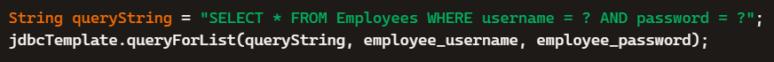
## 🧨 2. Cross-Site Scripting (XSS)

### ✔ Vulnerability
Unencoded user input rendered directly in HTML/JS.

### 🔎 Risk Impact
- **Severity:** High  
- **Risk:** Execution of malicious scripts in a user’s browser  
- **Impact:** Session hijacking, credential theft, and unauthorized user actions  

### 🖼️ Vulnerability
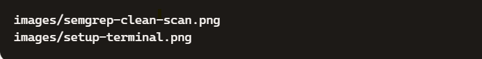

### 🛡️ Fix
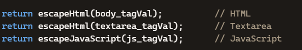

---

## 🧨 3. Command Injection

### ✔ Vulnerability
User input passed directly into system command.

### 🔎 Risk Impact
- **Severity:** Critical  
- **Risk:** Arbitrary command execution on the server  
- **Impact:** Full system compromise, data destruction, or remote control of the application host  

### 🖼️ Vulnerability
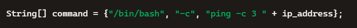

### 💥 Exploit


### 🛡️ Fix
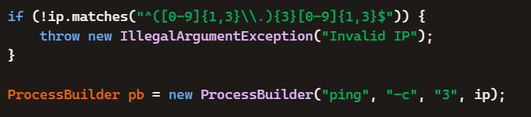

---

## 🧨 4. Path Traversal

### ✔ Vulnerability
User-controlled file paths allow directory traversal.

### 🔎 Risk Impact
- **Severity:** High  
- **Risk:** Unauthorized access to system files  
- **Impact:** Exposure of configuration files, credentials, or sensitive application data  

### 🖼️ Vulnerability
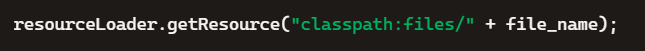

### 💥 Exploit
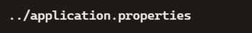

### 🛡️ Fix
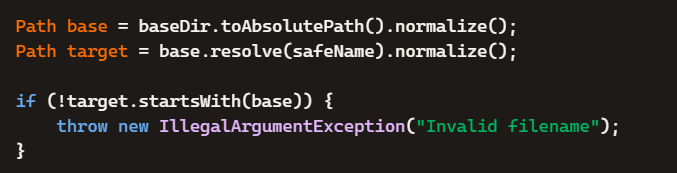

---

## 🧨 5. XPath Injection

### ✔ Vulnerability
User input concatenated into XPath query.

### 🔎 Risk Impact
- **Severity:** High  
- **Risk:** Unauthorized querying of XML data  
- **Impact:** Exposure of sensitive structured data and authentication bypass  

### 🖼️ Vulnerability
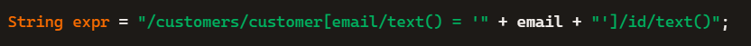

### 💥 Exploit


### 🛡️ Fix
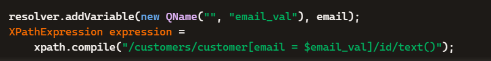

---

## 🧨 6. SMTP Header Injection

### ✔ Vulnerability
User input inserted into email headers.

### 🔎 Risk Impact
- **Severity:** Medium  
- **Risk:** Email header manipulation and unauthorized message routing  
- **Impact:** Spam distribution, phishing campaigns, and reputational damage  

### 🖼️ Vulnerability
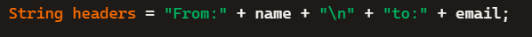

### 💥 Exploit


### 🛡️ Fix
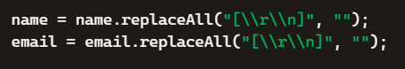

---

## 🧪 Static Analysis with Semgrep

### 🔍 Findings


🛡️ Summary of Mitigations

🛠️ How to Run This Project
1. Clone the repository
git clone https://github.com/kostacek/static-analysis-xss-semgrep.git
cd static-analysis-xss-semgrep
2. Install Semgrep
pip install semgrep
3. Run the custom rules
semgrep --config rules/ .
4. Review Findings
/code/vulnerable
/code/fixed
/images
📄 License (MIT)

MIT License
Copyright (c) 2026
